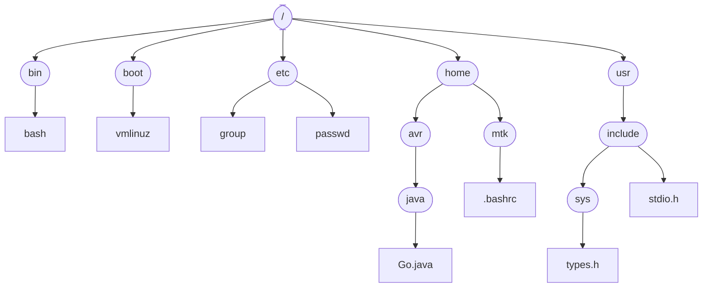

#shell #kernel #users #groups #sdh #directories #links #files


This chapter introduces a range of concepts related to Linux system programming.
It is intended for readers who have worked primarily with other operating systems, or 
who have only limited experience with Linux or another UNIX implementation.

## 2.1 The Core Operating System: The [[Kernel]]
The term _operating system_ is commonly used with two different meanings:

* To denote the entire package consisting of the central software managing a computer's resources and all of the accompanying standard software tools, such as command-line interpreters, graphical user interfaces, file utilities, and editors.
* More narrowly, to refer to the central software that manages and allocates computer resources (i.e., the CPU, RAM, and devices).

The term _kernel_ is often used as a synonym for the second meaning, and it is with this meaning of the term _operating system_ that we are concerned in this book.
Although it is possible to run programs on a computer without a kernel, the presence of
a kernel greatly simplifies the writing and use of other programs, and increases the power and flexibility available to programmers. The kernel does this by providing a software layer to manage the limited resources of a computer.

The Linux kernel executable typically resides at the path name /boot/vmlinuz,
or something similar.
### Tasks performed by the kernel
Among other things, the kernel performs the following tasks:
* **Process scheduling**:A computer has one or more CPU's, which execute the instructions of programs. Like other UNIX systems, Linux is a _preemptive multitasking_ operating system, _Multitasking_ means that multiple processes can simultaneously reside in memory and each may receive use of the CPU(s). _Preemptive_ means that the rules governing which processes receive use of the CPU and for how long are determined by the kernel process scheduler (rather than by the processes themselves).
* **Memory management**: RAM remains a limited resource that the kernel must share among processes in an equitable and efficient fashion. Like most modern operating systems, Linux employs virtual memory management, a technique that confers two main advantages:
   - Processes are isolated from one another and from the kernel, so that one process can't read or modify the memory of another process or the kernel.
   - Only part of a process needs to be kept in memory, thereby lowering the memory requirements of each process and allowing more processes to be held in RAM simultaneously. This leads to better CPU utilization, since it increases the likelihood that, at any moment in time, there is at least one process that the CPU(s) can execute.
- **Provision of a file system**: The kernel provides a file system on disk, allowing files to be created, retrieved, updated, deleted, and so on.
- **Creation and termination of processes**: The kernel can load a new program into memory, providing it with the resources that it needs in order to run. Such an instance of a running program is termed a process. Once a process has completed execution, the kernel ensures that the resources it used are freed for subsequent reuse by later programs.
- **Access to devices**: The devices (mouse, monitors, keyboards, disk and tape drives, etc) attached to a computer allow data transfer between the computer and the outside world, permitting input, output or both. The kernel provides programs with an interface that standardizes and simplifies access to devices, while at the same time arbitrating access by multiple processes to each device.
- **Networking**: The kernel transmits and receives network messages on behalf of user processes. This task includes routing of network packets to the target system.
- **Provision of a system call API**: Processes can request the kernel to perform various tasks using kernel entry points known as system calls. The Linux system call API is the primary topic of this book.


In addition to the above features, multi-user operating systems such as Linux generally provide users with the abstraction of a _virtual private computer_; that is, each user can log on to the system and operate largely independently of other users. they may run different or same programs,  each of which gets a share of the CPU and operates in its own virtual address space, and these programs can independently access devices and transfer information over the network. The kernel resolves potential conflicts in accessing hardware resources, so users and processes are generally unaware of the conflicts.

### Kernel mode and User mode
Modern processor architectures typically allow the CPU to operate in at least two different modes: _user mode_ and _kernel mode_. Hardware instructions allow switching from one mode to the other. Correspondingly, areas of virtual memory can be marked as being part of _user space_ or _kernel space_. When running in user mode, the CPU can access only memory that is marked as being in user space; attempts to access memory in kernel space result in a hardware exception. When running in kernel mode, the CPU can access both user and kernel memory space.
Certain operations can be performed only while the processor is operating in kernel mode. Examples include executing the halt instruction to stop the system, accessing the memory-management hardware, and initiating device I/O operations. By taking advantage of this hardware design to place the operating system in kernel space, OS implementer's can ensure that user processes are not able to access the instructions and data structures of the kernel, or to perform operations that would adversely affect the operation of the system.

### Process versus kernel views of the system
In many everyday programming tasks, we are accustomed to thinking about programming in a process-oriented way. However, when considering various topics
covered later in this book, it can be useful to reorient our perspective to consider
things from the kernel’s point of view. To make the contrast clear, we now consider
how things look first from a process viewpoint and then from a kernel viewpoint.
A running system typically has numerous processes. For a process, many things
happen asynchronously. An executing process doesn’t know when it will next time
out, which other processes will then be scheduled for the CPU (and in what order),
or when it will next be scheduled. The delivery of signals and the occurrence of
inter-process communication events are mediated by the kernel, and can occur at
any time for a process. Many things happen transparently for a process. A process
doesn’t know where it is located in RAM or, in general, whether a particular part of
its memory space is currently resident in memory or held in the swap area (a
reserved area of disk space used to supplement the computer’s RAM). Similarly, a
process doesn’t know where on the disk drive the files it accesses are being held; it
simply refers to the files by name. A process operates in isolation; it can’t directly
communicate with another process. A process can’t itself create a new process or
even end its own existence. Finally, a process can’t communicate directly with the
input and output devices attached to the computer.
By contrast, a running system has one kernel that knows and controls every-
thing. The kernel facilitates the running of all processes on the system. The kernel
decides which process will next obtain access to the CPU, when it will do so, and for
how long. The kernel maintains data structures containing information about all
running processes and updates these structures as processes are created, change
state, and terminate. The kernel maintains all of the low-level data structures that
enable the filenames used by programs to be translated into physical locations on
the disk. The kernel also maintains data structures that map the virtual memory of
each process into the physical memory of the computer and the swap area(s) on
disk. All communication between processes is done via mechanisms provided by
the kernel. In response to requests from processes, the kernel creates new processes and terminates existing processes. Lastly, the kernel (in particular, device
drivers) performs all direct communication with input and output devices, transfer-
ring information to and from user processes as required.
Later in this book we’ll say things such as “a process can create another process,” “a process can create a pipe,” “a process can write data to a file,” and “a process can terminate by calling exit().” Remember, however, that the kernel mediates
all such actions, and these statements are just shorthand for “a process can request
that the kernel create another process,” and so on

## 2.2 The [[Shell]]
A _shell_ is a special-purpose [[program]] designed to read commands typed by a user and execute appropriate programs in response to those commands. Such a program is sometimes known as a _command interpreter._
The term _login shell_ is used to denote the process that is created to run a shell when the user first logs in.
Whereas on some operating systems the command interpreter is an integral part of the kernel, on [[UNIX]] systems, the shell is a user process. Many different shells exist, and different users on the same computer can simultaneously use different shells. A number of important shells have appeared over time:
* _Bourne shell(sh)_
* _C shell(csh)
* _Korn shell(ksh)_
* _Bourne again shell(bash)_

The shells are designed not merely for interactive use, but also for the interpretation
of shell scripts, which are text files containing shell commands. For this purpose,
each of the shells has the facilities typically associated with programming lan-
guages: variables, loop and conditional statements, I/O commands, and functions.
Each of the shells performs similar tasks, albeit with variations in syntax. Unless
referring to the operation of a specific shell, we typically refer to “the shell,” with
the understanding that all shells operate in the manner described. Most of the
examples in this book that require a shell use bash, but, unless otherwise noted, the
reader can assume these examples work the same way in other Bourne-type shells.

## 2.3 Users and Groups
Each user on the system is uniquely identified, and users may belong to groups.

### **Users**
#users #uid #passwd
Every user of the system has a unique _login name_(username) and a corresponding numeric
user ID(UID). For each user, these re defined by a line in the system password file, /etc/passwd, which includes the following additional information:
- Group ID: the numeric group ID of the first of the groups of which the user is a member.
- Home directory: the initial directory into which the user is placed after logging in.
- Login shell: the name of the program to be executed to interpret user commands.

The password record may also include the user's password, in encrypted form. However, for security reasons, the password is often stored in the separate _shadow password file_, which is readable only by privileged users.

### **Groups**
#groups  #gid 
For administrative purposes—in particular, for controlling access to files and other
system resources—it is useful to organize users into groups. For example, the people
in a team working on a single project, and thus sharing a common set of files,
might all be made members of the same group. In early UNIX implementations, a
user could be a member of only one group. BSD allowed a user to simultaneously
belong to multiple groups, an idea that was taken up by other UNIX implementations and the POSIX.1-1990 standard. Each group is identified by a single line in
the system group file, /etc/group, which includes the following information:
- Group name: the (unique) name of the group.
- Group ID (GID): the numeric ID associated with this group.
- User list: a comma-separated list of login names of users who are members of
this group (and who are not otherwise identified as members of the group by
virtue of the group ID field of their password file record).

### **Superuser**
#su #root #superuser
One user, known as the superuser, has special privileges within the system. The
superuser account has user ID 0, and normally has the login name root. On typical
UNIX systems, the superuser bypasses all permission checks in the system. Thus,
for example, the superuser can access any file in the system, regardless of the per-
missions on that file, and can send signals to any user process in the system. The
system administrator uses the superuser account to perform various administrative
tasks on the system.

## 2.4 **Single Directory Hierarchy, Directories, Links, and Files**
#fs #hierarchy #directories 
The kernel maintains a single hierarchical directory structure to organize all files in
the system. (This contrasts with operating systems such as Microsoft Windows,
where each disk device has its own directory hierarchy.) At the base of this hierarchy is the root directory, named / (slash). All files and directories are children or
further removed descendants of the root directory. Figure 2-1 shows an example of
this hierarchical file structure.



### File types 
#filetypes
Within the file system, each file is marked with a type, indicating what kind of file it
is. One of these file types denotes ordinary data files, which are usually called
regular or plain files to distinguish them from other file types. These other file types
include devices, pipes, sockets, directories, and symbolic links.
The term file is commonly used to denote a file of any type, not just a regular file.

### Directories and links
#directories #links 
A directory is a special file whose contents take the form of a table of filenames coupled
with references to the corresponding files. This filename-plus-reference association
is called a link, and files may have multiple links, and thus multiple names, in the
same or in different directories.
Directories may contain links both to files and to other directories. The links
between directories establish the directory hierarchy shown in Figure 2-1.
Every directory contains at least two entries: . (dot), which is a link to the directory itself, and .. (dot-dot), which is a link to its parent directory, the directory above
it in the hierarchy. Every directory, except the root directory, has a parent. For the
root directory, the dot-dot entry is a link to the root directory itself (thus, /..
equates to /).

### Symbolic links
#symlinks 
Like a normal link, a symbolic link provides an alternative name for a file. But
whereas a normal link is a filename-plus-pointer entry in a directory list, a symbolic
link is a specially marked file containing the name of another file. (In other words,
a symbolic link has a filename-plus-pointer entry in a directory, and the file referred
to by the pointer contains a string that names another file.) This latter file is often
called the target of the symbolic link, and it is common to say that the symbolic link
“points” or “refers” to the target file. When a path-name is specified in a system call,
in most circumstances, the kernel automatically dereferences (or synonymously,
follows) each symbolic link in the path-name, replacing it with the filename to which
it points. This process may happen recursively if the target of a symbolic link is
itself a symbolic link. (The kernel imposes limits on the number of dereferences to
handle the possibility of circular chains of symbolic links.) If a symbolic link refers
to a file that doesn’t exist, it is said to be a dangling link.
Often hard link and soft link are used as alternative terms for normal and symbolic links.

### Filenames
#filenames
On most Linux file systems, filenames can be up to 255 characters long. Filenames
may contain any characters except slashes (/) and null characters (\0). However, it is
advisable to employ only letters and digits, and the . (period), (underscore), and
- (hyphen) characters. This 65-character set, "[-.(underscore)a-zA-Z0-9]", in SUSv3
as the portable filename character set.
We should avoid the use of characters in filenames that are not in the portable
filename character set because those characters may have special meanings within
the shell, within regular expressions, or in other contexts. If a filename containing
characters with special meanings appears in such contexts, then these characters
must be escaped; that is, specially marked—typically with a preceding backslash (\)—
to indicate that they should not be interpreted with those special meanings. In con-
texts where no escape mechanism is available, the filename is not usable.
We should also avoid filenames beginning with a hyphen (-), since such file-
names may be mistaken for options when specified in a shell command.

### [[Pathnames]]
#pathnames 
A pathname is a string consisting of an optional initial slash (/) followed by a series
of filenames separated by slashes. All but the last of these component filenames
identifies a directory (or a symbolic link that resolves to a directory). The last com-
ponent of a pathname may identify any type of file, including a directory. The
series of component filenames preceding the final slash is sometimes referred to as
the directory part of a pathname, while the name following the final slash is some-
times referred to as the file or base part of the pathname.
A pathname is read from left to right; each filename resides in the directory
specified by the preceding part of the pathname. The string .. can be used any-
where in a pathname to refer to the parent of the location so far specified in the
pathname.

A pathname describes the location of a file within the single directory hier-
archy, and is either absolute or relative:

* An absolute pathname begins with a slash (/) and specifies the location of a file
with respect to the root directory. Examples of absolute pathnames for files in
Figure 2-1 are /home/mtk/.bashrc, /usr/include, and / (the pathname of the root
directory).
* A relative pathname specifies the location of a file relative to a process’s current
working directory (see below), and is distinguished from an absolute pathname
by the absence of an initial slash. In Figure 2-1, from the directory usr, the file
types.h could be referenced using the relative pathname include/sys/types.h,
while from the directory avr, the file .bashrc could be accessed using the rela-
tive pathname ../mtk/.bashrc.

### [[Current working directory]]
#pwd 
Each process has a current working directory (sometimes just referred to as the pro-
cess’s working directory or current directory). This is the process’s “current location”
within the single directory hierarchy, and it is from this directory that relative path-
names are interpreted for the process.
A process inherits its current working directory from its parent process. A
login shell has its initial current working directory set to the location named in the
home directory field of the user’s password file entry. The shell’s current working
directory can be changed with the cd command.

### File ownership and permissions
#user #group #owner #read #write #execute #permissions #chmod 
Each file has an associated user ID and group ID that define the owner of the file
and the group to which it belongs. The ownership of a file is used to determine the
access rights available to users of the file.
For the purpose of accessing a file, the system divides users into three categories: the owner of the file (sometimes termed the user of the file), users who are
members of the group matching the file’s group ID ( group), and the rest of the
world (other). Three permission bits may be set for each of these categories of user
(making a total of nine permission bits): read permission allows the contents of the
file to be read; write permission allows modification of the contents of the file; and
execute permission allows execution of the file, which is either a program or a script
to be processed by some interpreter (usually, but not always, one of the shells).
These permissions may also be set on directories, although their meanings are
slightly different: read permission allows the contents of (i.e., the filenames in) the
directory to be listed; write permission allows the contents of the directory to be
changed (i.e., filenames can be added, removed, and changed); and execute (some-
times called search) permission allows access to files within the directory (subject to
the permissions on the files themselves).

## 2.5 File IO Model
One of the distinguishing features of the IO model on [[UNIX]] systems is the concept of universality of IO. This means that the same system calls (open(), read(), write(), close(), and so on) are used to perform I/O on all types of files, including devices. (The kernel translates the application's I/O requests into appropriate file system or device-driver operations that perform I/O on the target file or device.)
Thus, a program employing these system calls will work on any type of file.
The kernel essentially provides one file type: a sequential stream of bytes, which, in the case of disk files, disks, and tape devices, can be randomly accessed using the lseek() system call.
Many applications and libraries interpret the _newline_ character (ASCII code 10 decimal, sometimes also known as _linefeed_) as terminating one line of text and commencing another. UNIX systems have no _end-of-file_ character; the end of a file is detected by a read that returns no data.

### File descriptors
The I/O system calls refer to open files using a file descriptor, a (usually small) non-negative integer. A file descriptor is typically obtained by a call to open(), which takes a pathname argument specifying a file upon which I/O is to be performed.
Normally, a process inherits three open file descriptors when it is started by the shell: descriptor 0 is standard input, the file from which the process takes its input; descriptor 1 is standard output, the file to which the process writes its output; and descriptor 2 is standard error, the file to which the process write error messages and notification of exceptional or abnormal conditions. In an interactive shell or program, these three descriptors are normally connected to the terminal. In the _stdio_ library, these descriptors correspond to the file streams _stdin_, _stdout_, _stderr_.

### The _stdio_ library
To perform file I/O, C programs typically employ I/O functions contained in the standard C library. This set of functions, referred to as the _stdio_ library, includes fopen(), fclose(), scanf(), printf(), fgets(), fputs(), and so on. The stdio functions are
layered on top of the I/O system calls (open(), close(), read(), write(), and so on).

##  **2.6 Programs**
Programs normally exist in two forms. The first form is source code, human-readable text consisting of a series of statements written in a programming language such as C.
and the second form: binary machine instructions that the computer can understand.
The two meanings of the term program are normally considered synonymous, since the step of compiling and linking converts source code into semantically equivalent binary machine code.

### Filters
#cat #grep #tr #sort #sed #awk
A filter is a program that reads its input from stdin, performs some transformation of that input, and writes the transformed data to stdout.
Examples of filters include cat, grep, tr, sort, wc, sed, and awk.

### Command-line arguments
In C, programs can access the command-line arguments, the words that are supplied on the command line when the program is run. To access the command-line arguments, the main() function of the program is declared as follows:
```
	int main(int argc, char* argv[])
```
The argc variable contains the total number of command-line arguments, and the individual arguments are available as strings pointed to by members of the array argv. The first of those strings, argv[0], identifies the name of the program itself.

## **2.7 Processes**
a _process_ is an instance of an executing program. When a program is executed, the kernel loads the code of the program into virtual memory, allocates space for program variables, and sets up kernel bookkeeping data structures to record various information (such as processID, termination status, user IDs, and group IDs) about the processes.
From a kernel point of view, processes are the entities among which the kernel must share the various resources of the computer. For resources that are limited, such as memory, the kernel initially allocates some amount of the resource to the process, and adjusts this allocation over the lifetime of the process in response to the demands of the process and the overall system demand for that resource.
When the process terminates, all such resources are released for reuse by other processes. Other resources, such as the CPU and network bandwidth, are renewable, but must be shared equitably among all processes.

### **Process memory layout**
A process is logically divided into the following parts, known as segments:
[[Process Memory Layout]]
- Text: the instructions of the program.
- Data: the static variables used by the program.
- Heap: an area from which programs can dynamically allocate extra memory.
- Stack: a piece of memory that grows and shrinks as functions are called and
return and that is used to allocate storage for local variables and function call linkage information.

### Process creation and program execution
A process can create a new process using the _fork()_ system call. The process that calls _fork()_ is referred to as the _parent process_, and the new process is referred to as the _child process_. The kernel creates the child process by making a duplicate of the parent process. The child inherits copies of the parent's data, stack, and heap segments, which it may then modify independently of the parent's copies. (The program text, which is placed in memory marked as read-only, is shared by the two proccess.)
The child process goes on either to execute a different set of functions in the same code as the parent, or, frequently, to use the _execve()_ system call to load and execute an entirely new program. An _execve()_ call destroys the existing text, data, stack, and heap segments, replacing them with new segments based on the code of the new program.
Several related C library functions are layered on top of _execve()_, each providing a slightly different interface to the same functionality. All of these functions have name starting with the string _exec_, and where the differences don't matter, we'll use the notation _exec()_ to refer generally to these functions. Be aware, however, that there is no actual function with the name _exec()_.
### Process ID and parent process ID
#pid #ppid
Each process has a unique integer process identifier (PID). Each process also has a
parent process identifier (PPID) attribute, which identifies the process that requested
the kernel to create this process.

### Process termination and termination status
A process can terminate in one of two ways: by requesting its own termination
using the \_exit() system call (or the related exit() library function), or by being killed
by the delivery of a signal. In either case, the process yields a termination status, a
small non-negative integer value that is available for inspection by the parent process using the wait() system call. In the case of a call to \_exit(), the process explicitly
specifies its own termination status. If a process is killed by a signal, the termination
status is set according to the type of signal that caused the death of the process.
(Sometimes, we’ll refer to the argument passed to \_exit() as the exit status of the process, as distinct from the termination status, which is either the value passed to
\_exit() or an indication of the signal that killed the process.)
By convention, a termination status of 0 indicates that the process succeeded,
and a nonzero status indicates that some error occurred. Most shells make the termination status of the last executed program available via a shell variable named $?.

### **Process user and group identifiers (credentials)**
Each process has a number of associated user IDs (UIDs) and group IDs (GIDs).
These include:
- _Real user ID and real group ID_ : These identify the user and group to which the
process belongs. A new process inherits these IDs from its parent. A login shell
gets its real user ID and real group ID from the corresponding fields in the system password file.
- _Effective user ID and effective group ID_: These two IDs (in conjunction with the
supplementary group IDs discussed in a moment) are used in determining the
permissions that the process has when accessing protected resources such as
files and inter-process communication objects. Typically, the process’s effective
IDs have the same values as the corresponding real IDs. Changing the effective IDs
is a mechanism that allows a process to assume the privileges of another user
or group, as described in a moment.
- _Supplementary group IDs_: These IDs identify additional groups to which a process belongs. A new process inherits its supplementary group IDs from its parent. A 
   login shell gets its supplementary group IDs from the system group file.

### **Privileged processes**
In UNIX systems, a privileged process is one whose effective user ID is 0
(superuser). Such a process bypasses the permission restrictions normally applied
by the kernel. By contrast, the term unprivileged (or non-privileged) is applied to processes run by other users. Such processes have a nonzero effective user ID and
must abide by the permission rules enforced by the kernel.
A process may be privileged because it was created by another privileged process
for example, by a login shell started by root (superuser). Another way a process
may become privileged is via the set-user-ID mechanism, which allows a process to
assume an effective user ID that is the same as the user ID of the program file that
it is executing.

## Capabilities
Since kernel 2.2, Linux divides the privileges traditionally accorded to the super-
user into a set of distinct units called capabilities. Each privileged operation is 
associated with a particular capability, and a process can perform an operation only if it
has the corresponding capability. A traditional superuser process (effective user ID
of 0) corresponds to a process with all capabilities enabled.
Granting a subset of capabilities to a process allows it to perform some of the
operations normally permitted to the superuser, while preventing it from performing others.
Capabilities are described in detail in Chapter 39. In the remainder of the
book, when noting that a particular operation can be performed only by a privileged process, we’ll usually identify the specific capability in parentheses. Capability names begin with the prefix CAP_, as in CAP_KILL.

### The init process
When booting the system, the kernel creates a special process called init, the “parent
of all processes,” which is derived from the program file /sbin/init. All processes
on the system are created (using fork()) either by init or by one of its descendants.
The init process always has the process ID 1 and runs with superuser privileges. The
init process can’t be killed (not even by the superuser), and it terminates only when
the system is shut down. The main task of init is to create and monitor a range of
processes required by a running system. (For details, see the init(8) manual page.)

### Daemon processes
A daemon is a special-purpose process that is created and handled by the system
in the same way as other processes, but which is distinguished by the following
characteristics:
- It is long-lived. A daemon process is often started at system boot and remains
in existence until the system is shut down.
- It runs in the background, and has no controlling terminal from which it can
read input or to which it can write output.
Examples of daemon processes include syslogd, which records messages in the system log, and httpd, which serves web pages via the Hypertext Transfer Protocol
(HTTP).

## 2.8 **[[Memory Mappings]]**
The mmap() system call creates a new memory mapping in the calling process’s virtual
address space.
Mappings fall into two categories:
- A file mapping maps a region of a file into the calling process’s virtual memory.
Once mapped, the file’s contents can be accessed by operations on the bytes in
the corresponding memory region. The pages of the mapping are automatically loaded from the file as required.
- By contrast, an anonymous mapping doesn’t have a corresponding file. Instead,
the pages of the mapping are initialized to 0.
The memory in one process’s mapping may be shared with mappings in other processes. This can occur either because two processes map the same region of a file
or because a child process created by fork() inherits a mapping from its parent.
When two or more processes share the same pages, each process may see the
changes made by other processes to the contents of the pages, depending on
whether the mapping is created as private or shared. When a mapping is private,
modifications to the contents of the mapping are not visible to other processes and
are not carried through to the underlying file. When a mapping is shared, modifications to the contents of the mapping are visible to other processes sharing the same
mapping and are carried through to the underlying file.
Memory mappings serve a variety of purposes, including initialization of a
process’s text segment from the corresponding segment of an executable file,
allocation of new (zero-filled) memory, file I/O (memory-mapped I/O), and inter-
process communication (via a shared mapping).

## **2.9 Static and Shared Libraries**
An _object library_ is a file containing the compiled object code for a (usually logically related) set of functions that may be called from application programs. Placing code for a set of functions in a single object library eases the tasks of program creation and maintenance. Modern [[UNIX]] systems provide two type of object libraries:
_static libraries_ and _shared libraries_.
### **Static libraries**
Static libraries is essentially a structured bundle of compiled object modules. To use functions from a static library, we specify that library in the link command used to build a program. After resolving the various function references from the main program to the modules in the static library, the linker extracts copies of the required object modules from the library and copies these into the resulting executable file. We say that such a program is _statically linked_.
The fact that each statically linked program includes its own copy of the object modules required from the library creates a number of disadvantages. One is that the duplication of object code in different executable files wastes disk space. A corresponding waste of memory occurs when statically linked programs using the same library function are executed at the same time; each program requires its own copy of function to reside in memory. Additionally, if a library function requires modification, then , after recompiling that function and adding it to the static library, all applications that need to use the updated function must be re-linked against the recompiled library. but this makes applications run faster when calling those functions that are in statically linked libraries since they are in the same program memory itself.

### **Shared libraries**
Shared libraries were designed to address the problems with static libraries. If a program is linked against a shared library, then, instead of copying object modules from the library into the executable, the linker just writes a record into the executable to indicate that at run time the executable needs to use that shared library. When the executable is loaded into memory at run time, a program called the _dynamic linker_ ensures that the shared libraries required by the executable are found and loaded into memory, and performs run-time linking to resolve the function calls in the executable to the corresponding definitions in the shared libraries. At run time, only a single copy of the shared library needs to be resident in memory; all running programs can use that copy.
The fact that a shared library contains the sole compiled version of a function saves disk space. It also greatly eases the job of ensuring that programs employ the newest version of a function. Simply rebuilding the shared library with the new function definition causes existing programs to automatically use the new definitions when they are next executed.

## **2.10 Interprocess Communication and Synchronization**
A running [[Linux]] system consists of numerous processes, many of which operate independently of each other. Some processes, however, cooperate to achieve their intended purposes, and these processes need methods of communicating with one another and synchronizing their actions.
One way for processes to communicate is by reading and writing information in disk files. However, for many applications, this is too slow and inflexible.
Therefore, [[Linux]], like all modern [[UNIX]] implementations, provides a rich set of mechanisms for interprocess communication (IPC), including the following:

- _signals_, which are used to indicate that an event has occurred;
- _pipes_ and _FIFOs_, which can be used to transfer data between processes;
- _sockets_, which can be used to transfer data from one process to another, either one the same host computer or on different hosts connected by a network;
-  _file locking_, which allows a process to lock regions of a file in order to prevent other processes from reading or updating the file contents;
- _message queues_, which are used to exchange messages (packets of data) between processes;
- _semaphores_, which are used to synchronize the actions of processes; and 
- _shared memory_, which allows two or more processes to share a piece of memory.
When one process changes the contents of the shared memory, all of the other processes can immediately see the changes.

The wide variety of IPC mechanisms on [[UNIX]] systems, with sometimes overlapping functionality, is in part due to their evolution under different variants of the [[UNIX]] system and the requirements of various standards. For example, [[FIFO]]s and [[UNIX]] domain sockets essentially perform the same function of allowing unrelated processes on the same system to exchange data. Both exist in modern [[UNIX]] systems because [[FIFO]]s came from [[System V]], while sockets came from [[BSD]].

## **2.11 Signals**
Although we listed them as a method of IPC in the previous section, signals are more usually employed in a wide range of other contexts, and so deserve a longer discussion.
Signals are often described as "software interrupts." The arrival of a signal informs a process that some event or exceptional condition has occurred. There are various types of signals, each of which identifies a different event or condition.
Each signal type is identified by a different integer, defined with symbolic names of the form SIGxxxx.
Signals are sent to a process by the kernel, by another process ( with suitable permission), or by the process itself. For example, the kernel may send a signal to a process when one of the following occurs:
- the user typed the interrupt character (usually Ctrl-C) on the keyboard;
- one of the process's children has terminated;
- a timer (alarm clock) set by the process has expired; or
- the process attempted to access an invalid memory address.
Within the shell, the _kill_ command can be used to send a signal to a process. The _kill()_ system call provides the same facility within programs.

When a process receives a signal, it takes one of following actions, depending on the signal:
- it ignores the signal;
- it is killed by the signal; or
- it is suspended until later being resumed by receipt of a special-purpose signal
For most signal types, instead of accepting the default signal action, a program can choose to ignore the signal (useful if the default action for the signal is something other than being ignored), or to establish a _signal handler_. A signal handler is a programmer-defined function that is automatically invoked when the signal is delivered to the process. This function performs some action appropriate to the condition that generated the signal.
In the interval between the time it is generated and the time it is delivered, a signal is said to be _pending_ for a process. Normally, a pending signal is delivered as soon as the receiving process is next scheduled to run, or immediately if the process is already running. However, it is also possible to block a signal by adding it to
the process’s signal mask. If a signal is generated while it is blocked, it remains
pending until it is later unblocked (i.e., removed from the signal mask).

## **2.12 [[Threads]]**
In modern [[UNIX]] implementations, each process can have multiple threads of execution. One way of envisaging threads is as a set of processes that share the same
virtual memory, as well as a range of other attributes. Each thread is executing the
same program code and shares the same data area and heap. However, each thread
has it own stack containing local variables and function call linkage information.
Threads can communicate with each other via the global variables that they
share. The threading API provides condition variables and mutexes, which are primitives that enable the threads of a process to communicate and synchronize their
actions, in particular, their use of shared variables. Threads can also communicate
with one another using the IPC and synchronization mechanisms described in
Section 2.10.
The primary advantages of using threads are that they make it easy to share
data (via global variables) between cooperating threads and that some algorithms
transpose more naturally to a multithreaded implementation than to a multiprocess
implementation. Furthermore, a multithreaded application can transparently take
advantage of the possibilities for parallel processing on multiprocessor hardware.

## **2.13 Process Groups and Shell Job Control**
Each program executed by the shell is started in a new process. For example, the
shell creates three processes to execute the following pipeline of commands (which
displays a list of files in the current working directory sorted by file size):
```
	$ ls -l | sort -k5n | less
```
All major shells, except the Bourne shell, provide an interactive feature called job
control, which allows the user to simultaneously execute and manipulate multiple
commands or pipelines. In job-control shells, all of the processes in a pipeline are
placed in a new process group or job. (In the simple case of a shell command line containing a single command, a new process group containing just a single process is
created.) Each process in a process group has the same integer process group
identifier, which is the same as the process ID of one of the processes in the group,
termed the process group leader.
The kernel allows for various actions, notably the delivery of signals, to be per-
formed on all members of a process group. Job-control shells use this feature to
allow the user to suspend or resume all of the processes in a pipeline, as described
in the next section.

## **2.14 Sessions, Controlling Terminals, and Controlling Processes**
A session is a collection of process groups ( jobs). All of the processes in a session
have the same session identifier. A session leader is the process that created the session, and its process ID becomes the session ID.
Sessions are used mainly by job-control shells. All of the process groups created by a job-control shell belong to the same session as the shell, which is the session leader.
Sessions usually have an associated controlling terminal. The controlling terminal is established when the session leader process first opens a terminal device. For
a session created by an interactive shell, this is the terminal at which the user
logged in. A terminal may be the controlling terminal of at most one session.
As a consequence of opening the controlling terminal, the session leader
becomes the controlling process for the terminal. The controlling process receives a
SIGHUP signal if a terminal disconnect occurs (e.g., if the terminal window is closed).
At any point in time, one process group in a session is the foreground process
group ( foreground job), which may read input from the terminal and send output to
it. If the user types the interrupt character (usually Control-C) or the suspend character
(usually Control-Z) on the controlling terminal, then the terminal driver sends a signal
that kills or suspends (i.e., stops) the foreground process group. A session can have
any number of background process groups (background jobs), which are created by terminating a command with the ampersand (&) character.
Job-control shells provide commands for listing all jobs, sending signals to jobs,
and moving jobs between the foreground and background.


## **2.15 Pseudoterminals**
A pseudoterminal is a pair of connected virtual devices, known as the master and
slave. This device pair provides an IPC channel allowing data to be transferred in
both directions between the two devices.
The key point about a pseudoterminal is that the slave device provides an interface
that behaves like a terminal, which makes it possible to connect a terminal-oriented
program to the slave device and then use another program connected to the master device to drive the terminal-oriented program. Output written by the driver
program undergoes the usual input processing performed by the terminal driver
(for example, in the default mode, a carriage return is mapped to a newline) and is
then passed as input to the terminal-oriented program connected to the slave. Any-
thing that the terminal-oriented program writes to the slave is passed (after per-
forming all of the usual terminal output processing) as input to the driver program.
In other words, the driver program is performing the function normally performed
by the user at a conventional terminal.
Pseudoterminals are used in a variety of applications, most notably in the
implementation of terminal windows provided under an X Window System login
and in applications providing network login services, such as telnet and ssh.

## **2.16 Date and Time**
Two types of time are of interest to a process:
- _Real time_ is measured either from some standard point (calendar time) or from
some fixed point, typically the start, in the life of a process (elapsed or wall clock
time). On UNIX systems, calendar time is measured in seconds since midnight
on the morning of January 1, 1970, Universal Coordinated Time (usually
abbreviated UTC), and coordinated on the base point for time-zones defined
by the longitudinal line passing through Greenwich, England. This date, which
is close to the birth of the UNIX system, is referred to as the Epoch
- Process time, also called CPU time, is the total amount of CPU time that a process has used since starting. CPU time is further divided into system CPU time, the time spent executing code in the _kernel mode_ (i.e., executing system calls and performing other kernel services on behalf of the process), and user CPU time, the time spent executing code in _user mode_ 

The _time_ command displays the real time, the system CPU time, and user CPU time taken to execute the processes in a pipeline.

## **2.17 Client-Server Architecture**
At various points in this book, we discuss the design and implementation of client-
server applications.
A client-server application is one that is broken into two component processes:

- a _client_, which asks the server to carry out some _service_ by sending it a request message; and
- a _server_, which examines the client's request, performs appropriate actions, and then sends a response message back to the client.

Sometimes, the client and server may engage in an extended dialogue of requests
and responses.
Typically, the client application interacts with a user, while the server application provides access to some shared resource. Commonly, there are multiple
instances of client processes communicating with one or a few instances of the
server process

